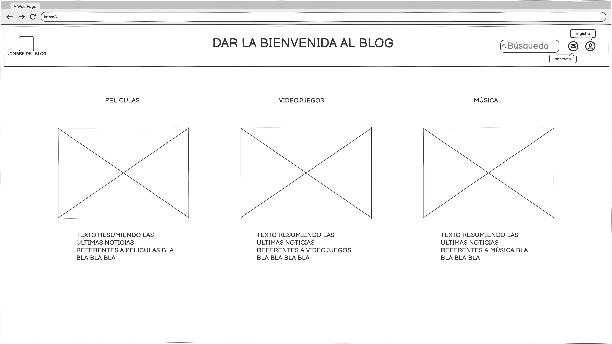
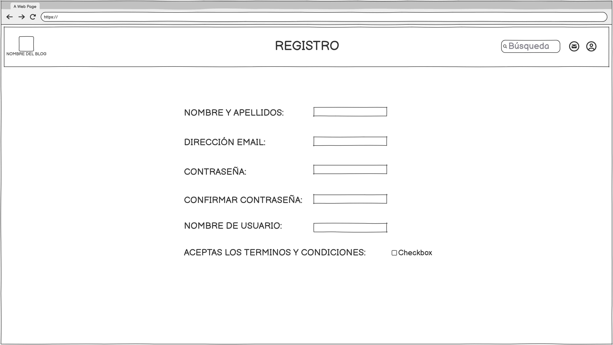
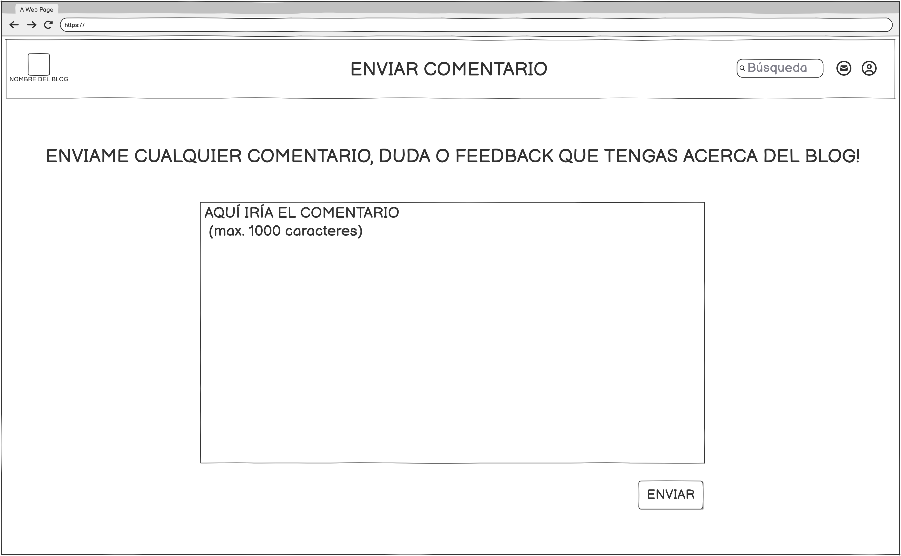

# Proyecto: “Desarrollo de una Aplicación Web Completa con HTML5 y CSS3”

## por Antonio José Monge Monge

**Descripción del Proyecto:**

Desarrollar una aplicación web usando los conocimientos de HTML5 y CSS3 vistos en clase. Ponerlos en práctica de manera avanzada, enfocandose en la estructura de esta web para que sea *responsive*. Siguiendo una serie de objetivos y de restricciones, siendos estos/as:

**OBJETIVOS:**

- Analizar y aplicar las características de diferentes lenguajes de marcas en el desarrollo de una aplicación web.
- Identificar y utilizar etiquetas y atributos HTML5 de manera efectiva.
- Aplicar hojas de estilo CSS3 para mejorar la presentación y usabilidad de la aplicación.
- Validar y optimizar los documentos HTML y CSS creados, asegurando la conformidad con los estándares web.
- Fomentar la autonomía y capacidad de gestión del alumnado en la realización del proyecto.

**RESTRICCIONES:**

- El uso de la etiqueta *STYLE*
- *Divs* se usarán *section* por ejemplo
- *Pxs* se usarán *rem*
- *IDs* en su lugar, utilizaré *class*
- *Buttons* pudiendo usar directamente enlaces

## Fase 1: Planificación del Proyecto (Wireframe y Estructura HTML)

El objetivo de esta fase es planificar la estructura y el diseño de la aplicación web antes de empezar a desarrollarla. Para ello, he realizado un esquema detallado del contenido y diseño a implementar en la web, utilizando **Balsamiq** para crear el wireframe. Esta planificación me permitirá organizar de forma efectiva los elementos clave de la página y estructurar el HTML de manera correcta.

### 1. Análisis de requisitos y objetivos del proyecto

Lo primero que hice fue analizar el enunciado del proyecto para entender qué debo hacer y qué características debe tener mi aplicación web. En este paso, definí los **requisitos funcionales y no funcionales** del proyecto, los cuales me ayudaron a establecer qué contenido debe tener la web y qué funcionalidades son esenciales, como la navegación entre secciones y la presentación de contenido multimedia.

- **Requisitos funcionales**: La web debe contener varias páginas con contenido organizado, como "Inicio", "Últimos Lanzamientos", "Próximos Lanzamientos" y "Recomendaciones". Además, debe ser fácil de navegar y tener una interfaz responsiva para adaptarse a diferentes dispositivos.
  
- **Requisitos no funcionales**: La web debe ser accesible para personas con discapacidades, debe cargarse rápidamente y ser compatible con los navegadores más comunes.

También elegí las tecnologías que voy a usar, es decir, **HTML5** y **CSS3**, porque son lenguajes estándar para crear páginas web. HTML me permitirá estructurar el contenido de la web de manera semántica, mientras que CSS me ayudará a darle estilo y hacerla responsiva.

### 2. Creación de un wireframe en Balsamiq

Una vez definidos los requisitos y objetivos, utilicé **Balsamiq** para crear un wireframe, que es un esquema visual de la página web. Este wireframe me permitió organizar los elementos principales que tendrá la web, como el **encabezado**, el **menú de navegación**, el **área de contenido principal**, y el **pie de página**.

El wireframe refleja la estructura básica de las páginas, mostrando cómo estarán distribuidos los elementos en cada pantalla. A continuación, te muestro cómo quedaría el diseño de la página de inicio:

- En la parte superior estará el **encabezado** con el logo y el menú de navegación.
- Bajo el encabezado, se verá una serie de **secciones** como "Últimos Lanzamientos", "Próximos Lanzamientos" y "Recomendaciones".
- Al final de la página, incluiré un **pie de página** con derechos de autor y enlaces de contacto.

Este paso es muy importante porque me da una visión clara de cómo se verá la web antes de comenzar a escribir el código.

Más abajo te muestro los prototipos que hice en Balsamiq, hay que tener en cuenta que de cara a la versión final si que se cambió algún que otro detalle. Bien por demasiada ambición o simplemente por comodidad.

### 3. Estructura HTML planificada

En esta parte de la fase, planifiqué cómo voy a estructurar el código HTML. Para ello, he identificado las **etiquetas y atributos** que utilizaré en cada sección de la web.

Por ejemplo, para el **encabezado**, utilizaré la etiqueta `<header>`, dentro de la cual irán el logo y el menú de navegación. El menú de navegación se organizará con las etiquetas `<nav>`, usando `<href>` para cada enlace.

Cada **sección de contenido** (como "Últimos Lanzamientos") la marcaré con la etiqueta `<section>`, y cada título de sección irá dentro de una etiqueta `<h2>`. Además, las imágenes de las secciones se insertarán con la etiqueta ``, siempre añadiendo un atributo `alt` para la accesibilidad.

El **pie de página** se estructurará dentro de una etiqueta `<footer>`, donde también incluiré el texto de derechos de autor y los enlaces adicionales.

## Fase 2: Diseño y Desarrollo del Frontend (HTML y CSS)

En esta fase, mi objetivo fue desarrollar la estructura HTML de la aplicación web y aplicar hojas de estilo CSS para darle un diseño atractivo y funcional. Primero, creé la estructura básica de la página con HTML, y luego la estilisé con CSS para que se vea bien y sea fácil de usar.

### 1. Configuración del Entorno de Desarrollo

Para empezar, preparé todo lo necesario para trabajar en el proyecto. Esto incluyó:

- **Estructura de carpetas**: Creé varias carpetas para organizar mejor el proyecto:
- `/css`: Para los archivos de estilos CSS.
- `/img`: Para las imágenes que usará la web.
- `/js`: En caso de necesitar scripts en el futuro (aunque aún no los he utilizado).
  
- **Archivos principales**:
- `index.html`: El archivo principal de la página de inicio.
- `estilos.css`: El archivo donde escribí todos los estilos para la web.

También configuré mi editor de código **VSCode** usé algunas extensiones útiles como **Prettier** (para formatear el código), **Emmet** (para escribir más rápido el HTML) y **Live Server** (para ver los cambios en tiempo real mientras trabajo).

### 2. Estructuración del proyecto

El siguiente paso fue comenzar con la estructura HTML. Esto se basó en el **wireframe** que hice en la fase anterior. Empecé creando la página de inicio, y luego otras páginas secundarias.

#### 2.1 Creación de la página de inicio

Para la página de inicio, utilicé etiquetas semánticas para organizar el contenido. Esto incluye:

- **Encabezado (`<header>`)**: Aquí puse el logo y el menú de navegación.
- **Secciones de contenido**: Utilicé varias secciones (`<section>`) para mostrar diferentes tipos de información como los "Últimos Lanzamientos", "Próximos Lanzamientos", y "Recomendaciones".
- **Pie de página (`<footer>`)**: Aquí incluí un pequeño mensaje de derechos de autor.

También me aseguré de que todos los enlaces entre las páginas estuvieran bien hechos, para que al hacer clic en cualquier sección del menú de navegación, nos llevara a la página correcta.

#### 2.2 Desarrollo de páginas secundarias

Además de la página de inicio, creé otras páginas secundarias como:

- **Página de Contacto**: Incluí un formulario básico donde los usuarios pueden enviar su nombre, email y mensaje.
- **Página de Acceso**: En esta página te da la opción de Registrarte o Acceder con una cuenta. En la de *Registro* incluí de nuevo otro formulario con campos tipicos de registro, luego en la de *Acceso* te redirige directamente a un perfil ya hecho, simulando que ya estás registrado en el blog.
- **Página de Secciones (Cine, Videojuegos y Música)**: Estas páginas son distintas categorías de los medios que abarca este blog. Separados en:

1. Últimos Lanzamientos: Se analiza un lanzamiento reciente dentro del medio.
2. Próximos Lanzamientos: Cubre un lanzamiento próximo.
3. Recomendaciones: Sección donde se dar a conocer alguna recomendación personal.

Solamente la página de Ultimos Lanzamientos referente a Videojuegos tiene contenido, para hacer una especie de muestra de como sería la estructura de esta. Las demás son simples *placeholders*.

#### 2.3 Enlazado entre páginas

Aseguré que todas las páginas estuvieran bien conectadas entre sí. Por ejemplo, en el menú de navegación de cada página, añadí enlaces que me permiten navegar entre ellas fácilmente.

### 3. Aplicación de hojas de estilo CSS

Luego de tener la estructura básica con HTML, pasé a darle estilo a la página utilizando **CSS**.

#### 3.1 Organización de los estilos

Para organizar los estilos y seguir buenas prácticas, utilicé un solo archivo de CSS (`estilos.css`) que contiene todos los estilos de la página. Un poco caótico tengo que reconocer, me gustaría ordenarlo mejor a posteriori.

#### 3.2 Estilización

Algunos de los estilos más importantes que apliqué fueron:

- **Estilos globales**: Definí la tipografía (fuentes), colores y márgenes generales para que todo se vea de forma coherente.
- **Cabecera y pie de página**: Para el encabezado y el pie de página, utilicé colores y disposiciones simples, con una barra de navegación centrada.
  
También añadí algunos **efectos y transiciones** con CSS. Por ejemplo, cuando el usuario pasa el ratón sobre un enlace, cambia de color de forma suave, o cuando se situa el ratón encima de una sección, esta se agranda destacando entre las demás.

#### 3.3 Diseño responsivo

Para asegurarme de que la página se vea bien en dispositivos de cualquier tamaño (móviles, tablets, computadoras de escritorio), utilicé **media queries**. Esto permite que los elementos se adapten según el tamaño de la pantalla.

Algunos ejemplos de lo que hice:

- En pantallas pequeñas (como en móviles), cambié la disposición de las secciones para que todo fuera más compacto y fácil de leer.
- También ajusté el tamaño de las imágenes para que no se salieran de la pantalla en pantallas más pequeñas.

### 4. Inserción de imágenes y vídeos

Para hacer la página más atractiva, añadí varias imágenes y vídeos. Aseguré que estuvieran bien optimizados para la web, es decir, con un buen tamaño y formato adecuado. Además, utilicé el atributo `alt` para las imágenes, lo que ayuda a la accesibilidad de la web (por ejemplo, para personas con dificultades visuales).

### Producto Final

- **Estructura HTML**: Páginas web creadas con una estructura organizada y semántica.
- **Archivo CSS**: El diseño visual de la página, con efectos, colores y disposición adaptados a las necesidades del proyecto.
- **Diseño responsivo**: La página se adapta correctamente a diferentes tamaños de pantalla.

Al final, la página web quedó bien estructurada, visualmente atractiva y funcional, cumpliendo con las expectativas del proyecto.

## Fase 3: Implementación y Validación del Código

### 1. Revisión y corrección del código HTML

Revisé el archivo `index.html` y las demás páginas manualmente, comprobando que todas las etiquetas estuvieran correctamente cerradas y anidadas. Me fijé en lo siguiente:

1. **Etiquetas semánticas**: Revisé que usé etiquetas como `<header>`, `<main>` y `<footer>` en lugar de `
` genéricos.
2. **Atributos necesarios**: Comprobé que todas las imágenes tuvieran el atributo `alt` para describirlas, y revisé que los enlaces tuvieran un texto claro.
3. **Estructura lógica**: Verifiqué que las secciones estuvieran ordenadas de manera coherente, con encabezados jerárquicos (`<h1>`, `<h2>`, etc.) y listas correctamente formateadas.

Después de corregir algunos errores menores, como etiquetas mal cerradas o atributos que faltaban, el código quedó limpio.

---

### 2. Revisión y corrección del CSS

Leí todo el archivo `estilos.css` para comprobar que no tuviera errores. Esto fue lo que hice:

1. **Propiedades correctas**: Revisé que todas las propiedades estuvieran bien escritas (por ejemplo, `padding` en lugar de `paddinng`).
2. **Organización**: Agrupé los estilos relacionados para que fueran más fáciles de leer y eliminé reglas duplicadas que encontré al final del archivo.
3. **Consistencia**: Verifiqué que los colores, fuentes y tamaños fueran consistentes en toda la página.

---

### 3. Mejoras en la accesibilidad y usabilidad

Aunque no usé herramientas avanzadas, probé la página directamente en el navegador para asegurarme de que funcionara bien y fuera accesible:

1. **Accesibilidad manual**:
   - Revisé que el texto fuera legible, ajustando el contraste de algunos colores para que no fueran muy claros.

2. **Pruebas en dispositivos**:
   - Abrí la página en diferentes dispositivos: mi móvil, mi portátil y el sobremesa. Cambié el tamaño de la ventana del navegador para ver si el diseño responsive funcionaba bien.
   - Detecté algunos problemas con las imágenes en pantallas pequeñas y ajusté los estilos usando media queries.

3. **Rendimiento básico**:
   - Reduje el tamaño de algunas imágenes manualmente utilizando un editor online antes de subirlas.
   - Revisé que no hubiera archivos CSS o imágenes innecesarias ocupando espacio.

---

### Producto Final

- **Código limpio y funcional**: El HTML y CSS están corregidos y organizados, asegurando que la página se vea bien y funcione correctamente.
- **Accesibilidad mejorada**: Implementé mejoras básicas para que la página sea más fácil de usar, incluso con teclado.
- **Diseño adaptable**: Realicé ajustes en los estilos para garantizar que el diseño se vea bien en pantallas pequeñas y grandes.

Aunque no usé herramientas avanzadas, hice un esfuerzo por validar y optimizar el proyecto a mano, asegurándome de que cumpla con los objetivos de esta fase.

## Fase 4: Videotutorial

### [Link al Videotutorial](https://www.youtube.com/watch?v=lhpDpVUvg-w) obviar la marca de agua del windows piratilla jejjej 